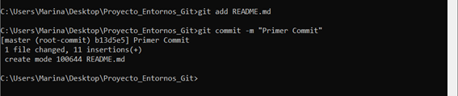

 TAREA GIT
Documento del proceso Proyecto_Entornos_Git:
1. Instalación de Git en Windows mediante cmd con el comando "winget install git.git"
Comprobamos que está instalado correctamente mediante "git --version"

2. Configuración de usuario y correo en git con los comandos "config --global user.name "marinapm72" e "config --global user.email "a24marinapm@iessanclemente.net"

3. Creación de una carpeta en el escritorio que contenga el proyecto. Para el posicionamiento en el escritorio se utiliza "cd C:\Users\Marina\Desktop" y se crea una carpeta con "mkdir Proyecto_Entornos_Git".
4. Para la creación de un repositorio nos posicionamos en la raíz del proyecto con el comando anterior "cd" e introducimos el siguiente comando "git init".

5. Producción del fichero .gitignore con la herramienta "copy con .gitignore" y el texto correspondiente para las extensiones y ficheros que git ignorará. Al finalizar se pulsa Ctrl+Z+Enter.

6. Obtención del fichero README.md y la carpeta images en la raíz del proyecto mediante sus respectivos comandos "echo. >README.md" y "mkdir images".

7. Creación de un repositorio remoto en GitHub. El nombre del repositorio es "EntornosGit" y su dueño "marinapm72". No inicializa con el fichero README y .gitignore porque ya se han incluido en el repositorio local. 
8. La URL que proporciona GitHub a partir del repositorio remoto es copiada al cmd y añadida con "git remote add origin https://github.com/marinapm72/EntornosGit.git". Al escribir posteriormente el comando "remote -v" se comprueba que este repositorio remoto se ha añadido correctamente.

--- PRIMER COMMIT------
9. Para hacer el primer commit, guardamos este archivo y en cmd se hace lo siguiente:
- Añadir el archivo README.md al área de preparación: "git add README.md"
- Realizar un commit: "git commit -m "Primer Commit".

--- SEGUNDO COMMIT-----
10. Se añaden las capturas de pantalla a la carpeta images en la raíz del proyecto. 
11. Repetición del paso 9, añadiendo esta vez todos los archivos modificados:
- "git add ."
- "git commit -am "Segundo Commit"

--- TERCER COMMIT-----
12. Se introducen las imágenes explicativas en este documento.
13. Repetición del paso 11.

---GUARDAR LOS CAMBIOS EN EL REPOSITORIO REMOTO-----
14. Se gestiona mediante el comando "git push origin master" siendo master el nombre de la rama principal.

Apunte: hay commits posteriores para corregir errores y añadir información.
